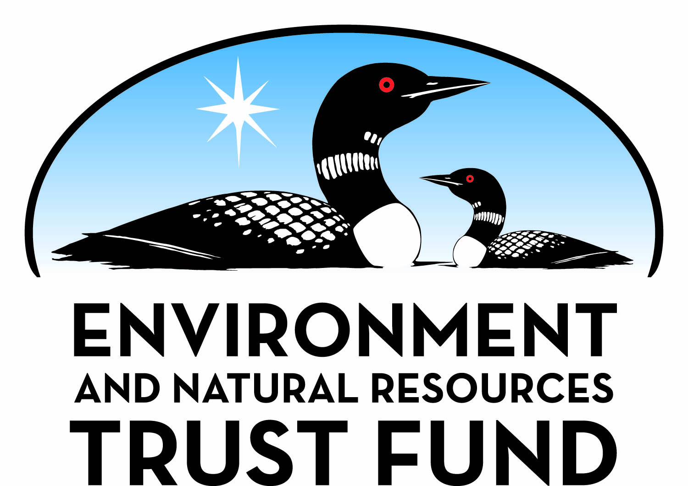

# README for Machine Learning Methods Workshop

## Workshop intention and facilitators

This workshop was intended for ecological or environmental scientists that are familiar to some extent with R, statistical modeling, or other related work. We attempted to introduce the fundamentals of machine learning and provide examples for some commonly used tree-based, supervised learning models. 

The workshop took place April 16, 2026 on the University of Minnesota campus, and all slides and code examples are provided here for reference.

The workshop was developed by Grant Vagle, Jeremiah Shrovnal, and Lynn Waterhouse with vital contributions from Olivia Nyffeler and Molly Tilsen. **Contact Grant (vagle019@umn.edu) with any questions**.

Funding for this workshop was provided by the Minnesota Environment and Natural Resources Trust Fund as recommended by the Legislative-Citizen Commission on Minnesota Resources (LCCMR).

## Workshop outline

1. What is machine learning? This workshop will focus on supervised machine learning
2. Classification and regression - focus on model evaluation and cross-validation
3. Random forests, handling correlated predictor variables, and basic model interpretation
4. Boosted regression trees, model tuning, and model interpretation with SHAP values

## Before you start

- Download and install R and RStudio: [https://posit.co/download/rstudio-desktop/](https://posit.co/download/rstudio-desktop/)
- If you're not familiar with the `tidyverse` or code piping, take a look [here](https://bookdown.org/yih_huynh/Guide-to-R-Book/tidyverse.html). We'll be using the `tidyverse` for data manipulation a lot in the workshop.
- Install packages:
  - Use the `code/install_wkshp_packages.R` to install the packages OR
  - Open the first script (`code/01_cart_examples.qmd`) and the packages are installed near the start of the script
- Take a look around this repository

## How to use this repository

Not familiar with GitHub? No problem, download the `.zip` file by clicking the green "Code" button at the top of the page, then click "Download Zip". Once the download is finished, unzip the file and you can open the `ml_methods_workshop.RProj` file in RStudio on your computer.

Comfortable with GitHub? You can `clone` or `fork` this repo to use it locally, or just download the `.zip` as above.

## Organization of this repository

`slides/`

  - Contains pdfs of all slides used in the workshop presentations.

`code/`

  - `01_cart_examples.qmd` - 1st set of example code for CART models, model evaluation, and cross-validation.
  - `02_randomforest_examples.qmd` - Example code for Random Forest models, including model tuning and handling correlated predictors, and basic model interpretation.
  - `03_BRTs_examples.qmd` - Example code for Boosted Regression Tree models, including model tuning and advanced model interpretation with SHAP values.
  - `extras/` - contains simulation code that created the datasets
  - `images/` - contains images included in the code files

`data/`

  - Contains the datasets referenced in the code files.

