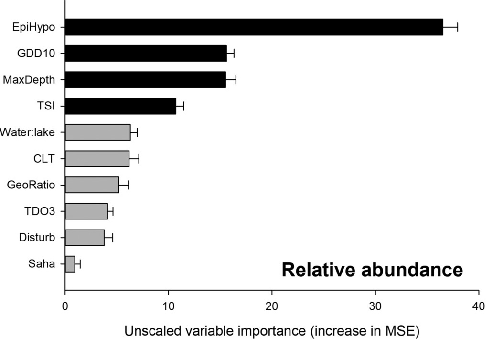
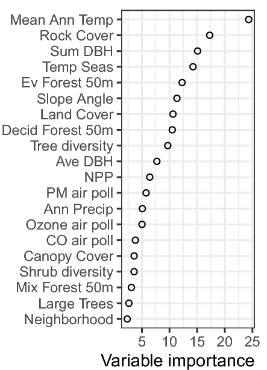

```{r}
#| results: false
#| message: false

library(randomForest)
library(Metrics)
library(dplyr)
library(ggplot2)
library(pdp)
library(interp)

set.seed(22)
```

## Random forests in R

Random forests can be built with a number of packages in R. We're going to use the `randomForest` package in this workshop, but some others can be found in this table (from Claude).

| Package | Best for | Pros | Cons | Speed |
|---------------|---------------|---------------|---------------|---------------|
| `randomForest` | Learning, small–medium datasets | \+ The classic, well-documented reference implementation<br>+ Simple, stable API<br>+ Built-in `varImpPlot` and `tuneRF`<br>+ Works seamlessly with `caret` / `tidymodels` | − Single-threaded — slow on large data<br>− High memory use (stores all trees)<br>− No native support for sparse matrices | Moderate |
| `ranger` | Production use, large datasets | \+ Multi-threaded (set `num.threads`) — much faster<br>+ Low memory footprint<br>+ Survival, regression, and classification<br>+ Drop-in replacement for `randomForest` syntax | − Fewer built-in diagnostics / plot helpers<br>− Variable importance less flexible than `randomForest` | Fast |
| `h2o` | Very large data, distributed computing | \+ Distributed / cluster-ready (runs on Spark, AWS)<br>+ Auto-handles categorical encoding<br>+ Built-in cross-validation and grid search<br>+ Supports extremely large datasets | − Requires a running H2O JVM cluster<br>− More complex setup; heavier dependency<br>− Data must be converted to H2O frames | Very fast |
| `Rborist` | High-dimensional data | \+ Very fast on wide (high-p) data<br>+ Memory-efficient tree storage<br>+ Parallel by default | − Less mature ecosystem and documentation<br>− Fewer output diagnostics<br>− Smaller community / fewer Stack Overflow answers | Fast |
| `partykit` (cforest) | Unbiased variable selection | \+ Conditional inference trees — unbiased variable importance<br>+ Better handling of mixed-type / correlated predictors<br>+ Rigorous statistical framework | − Noticeably slower than ranger / randomForest<br>− Less intuitive API for beginners<br>− Fewer ecosystem integrations | Slow |

# Back to our red fish example

{width="50%" fig-align="left"}

We're going to use our red fish example from Superior Red Lake of the Woods again, but this time, we're going to model red fish abundance based on the other predictor variables.

$$ \text{red fish abundance} \sim \text{spring temp} + \text{summer temp} + \text{blue fish index} $$

```{r}
#| label: redfish_read
#| echo: true

redfish_data <- read.csv(here::here("data", "redfish_recruitment.csv"))
str(redfish_data)
```

This time, we're going to pretend it's 2001 (the birth year of random forests! [Breiman 2001](https://doi.org/10.1023/A:1010933404324)), and rely only on the first 80 years of data. We'll use the bagging approach in the random forest algorithm to evaluate the model as we build it. After we're done with the example, we'll see how well we can predict 2001-2021 (but not until the end!).

```{r}
#| label: redfish split

redfish_train <- redfish_data |>
  dplyr::filter(year <= 2001)
```

## Example model with default parameters

First, we'll build an example model with default parameters just to get familiar with the code and output.

```{r}
#| label: rf example mod


mod_ex <- randomForest::randomForest(
  redfish_abundance ~ ., # the . implies everything else in the dataset
  data = redfish_train |>
    # remove the un-used variables
    dplyr::select(-dplyr::any_of(c("year", "recruitment")))
)

plot(mod_ex)
print(mod_ex)

# predicted vs observed
data.frame(
  actual = redfish_train$redfish_abundance,
  predicted = mod_ex$predicted) |>
  ggplot(aes(x = actual, y = predicted)) +
  geom_point() +
  geom_abline(slope = 1, intercept = 0, linetype = "dashed") +
  lims(x = c(0, 25), y = c(0, 25)) +
  theme_minimal()

```

### Too many trees? No problem!

One convenient feature of random forests is that you can't overfit by building too many trees. If you build a really large number of trees, you still see the out-of-bag (OOB) error hover at the same value. It doesn't help you to build many more trees than you need, but it doesn't hurt you in terms of overfitting either. As long as you see the OOB error stabilize you probably have enough trees; good enough is good enough!

To show this, let's build another example with 10,000 trees.

```{r}
#| label: rf example mod ntree

mod_ex_ntree <- randomForest::randomForest(
  redfish_abundance ~ ., # the . implies everything else in the dataset
  data = redfish_train |>
    # remove the un-used variables
    dplyr::select(-dplyr::any_of(c("year", "recruitment"))),
  ntree = 10000
)

plot(mod_ex_ntree)
print(mod_ex_ntree)

```

We end up with basically identical results! This is not true for the boosting approaches we'll learn in the next section, but is a really nice feature of random forests.

## Building our final model for red fish abundance

Much of the time, the defaults for random forests are pretty good (to see all of the defaults, run `?randomForest()`). But it's still a good idea to explore the hyper-parameter space to ensure you're getting the best possible model.

This is called **model tuning**, and it works differently for each algorithm, but is always a good idea and sometimes required depending on the algorithm you're working with.

Random forests have a few hyper-parameters that you can tune:

-   **mtry**: the number of variables sampled as candidates at each split in the tree
    -   Regression: Defaults to 1/3 of the number of variables you have in the model
    -   Classification: defaults to square root of the number of variables
-   **sampsize**: size of sample to draw to build each tree (defaults)
-   **nodesize** / **maxnodes**: specify how deep an individual tree can be built
    -   **nodesize**: minimum number of data points in terminal nodes (bottom of tree)
        -   defaults to 5 for regression, 1 for classification
    -   **maxnodes**: max number of terminal nodes for a tree; operates secondary to nodesize

::: callout-note
## Got it in the bag?

Can you think of how to use `mtry` to adjust the `randomForest()` call above to instead utilize the *bagging* algorithm?
:::

We'll tune this random forest model by looping over different values of `mtry`, we'll ignore the other ones for now.

We'll build a model with each possible value of `mtry` and compare the mean-squared-error (aka mean of squared residuals) and the pseudo-R<sup>2</sup> (aka % var explained). Both of those values are provided in the `print()` call.

```{r}
mtry_to_check <- 1:3 # we're including just 3 predictors
  
rf_mtry_list <- list()
for (m in mtry_to_check) {
  rf_mtry_list[[m]] <- randomForest::randomForest(
    redfish_abundance ~ ., # the . implies everything else in the dataset
    data = redfish_train |>
      # remove the un-used variables
      dplyr::select(-dplyr::any_of(c("year", "recruitment"))),
    ntree = 500,
    mtry = m
  )
  
  print(rf_mtry_list[[m]]) # print to compare performance
}
  
```

It looks like we get somewhat improved performance (lower error and higher variance explained) with `mtry = 2`, so we'll use that one as our final model going forward.

```{r}
redfish_mod_final <- rf_mtry_list[[2]]

plot(redfish_mod_final)

# predicted vs observed
data.frame(
  actual = redfish_train$redfish_abundance,
  predicted = redfish_mod_final$predicted) |>
  ggplot(aes(x = actual, y = predicted)) +
  geom_point() +
  geom_abline(slope = 1, intercept = 0, linetype = "dashed") +
  lims(x = c(0, 25), y = c(0, 25)) +
  theme_minimal()
```

It doesn't predict the extremes very well - when the actual value is high, the predicted value is mostly under-predicting. This is fine for us, since we can't do anything about red fish abundance (because it's not a real fish), but can be a common problem for models like this. There are some approaches that can help though (e.g., evaluating models based on a metric that emphasizes the extremes), and predicting extreme events has its own body of literature.

Let's also check the time series trends to see how well those line up:

```{r}
# predicted vs observed
data.frame(
  year = redfish_train$year,
  actual = redfish_train$redfish_abundance,
  predicted = redfish_mod_final$predicted
) |>
  tidyr::pivot_longer(cols = c("actual", "predicted"), names_to = "type", values_to = "value" ) |>
  ggplot(aes(x = year, y = value, group = type, color = type)) +
  geom_line() +
  scale_color_manual(breaks = c("actual", "predicted"),
                     values = c("black", "orange")) +
  theme_minimal()
```

Definitely not the best, but also not the worst. Our model is only capturing 38% of the variation in abundance, so we shouldn't expect it to be much better than this.

Try playing with `nodesize` option in the random forest call to see if you can improve the predictive performance.

::: callout-note
## Getting more bang for your buck (or fish)
Can you think of other ways we could add predictors to this model based on only the covariates provided?
:::

## Now let's dig into the model with **model interpretation**

"Model interpretation" is a fancy way of saying that we'll try and see what the model is doing to make these predictions. In a linear regression, we would just look at the coefficients. But here, we have 500 different decision trees making our predictions, so we have to summarize the variable contributions from many places, and it gets more complicated.

We'll look into the model in two ways. First, we'll examine the **variable importance**. Then we'll look at **partial dependence plots** for each variable.

### Variable importance

For random forests, variable importance is calculated with the following metrics:

-   For regression,
    -   **increase in node purity** when the variable is included
    -   **increase in % MSE** when the variable is permuted
-   For classification,
    -   **mean decrease in accuracy** if the variable was not included
    -   **mean decrease in Gini index** if the variable was not included

For a more detailed overview, see [this link](https://www.displayr.com/how-is-variable-importance-calculated-for-a-random-forest/).

Here, we're doing regression, so we'll look at the increase in node purity. The `randomForest` package has some nice built-ins for this.

```{r}
# get importance values
randomForest::importance(redfish_mod_final)

# plot them
randomForest::varImpPlot(redfish_mod_final)
```

So in this model, `bluefish_index` is the most important in driving our predictions, with `summer_temp_c` and `spring_temp_c` coming second and third.

If we want to return the difference in MSE, we have to set `importance=TRUE` in the `randomForest()` call. This method takes longer but is generally considered more robust.

```{r}
redfish_mod_final_imp <- randomForest::randomForest(
    redfish_abundance ~ ., # the . implies everything else in the dataset
    data = redfish_train |>
      # remove the un-used variables
      dplyr::select(-dplyr::any_of(c("year", "recruitment"))),
    ntree = 500,
    mtry = 2,
    importance = TRUE
  )

# get importance values
randomForest::importance(redfish_mod_final_imp)

# get unscaled importance values (better statistical properties)
randomForest::importance(redfish_mod_final_imp, scale = FALSE)
# or redfish_mod_final_imp$importance

# get SD of the importance used to create z-scores
redfish_mod_final_imp$importanceSD

# plot them
tibble::as_tibble(
  randomForest::importance(redfish_mod_final_imp),
  rownames = "Variable"
) |> 
  ggplot(aes(x = `%IncMSE`, y = forcats::fct_reorder(Variable, `%IncMSE`))) +
    geom_col() +
    theme_minimal() +
    labs(y="")
```

The ordering of importance doesn't change with the method used in this example.

Since our model has only three variables, we include a couple examples with more variables here:

{width="40%" fig-align="left"}

{width="40%" fig-align="left"}

::: callout-note
## Are these forests random?

Given the bootstrap procedure introduces randomness to this process, try rerunning the importance functions above and see if the values change. Depending on your dataset, it's possible that the relative ordering of the variables may change. If this is a concern with your dataset, you can create multiple forests and evaluate summary statistics of the importance measure.
:::

::: callout-note
## Getting in tune

Now that you have a relative ordering of parameter importance, it is possible to use this information to perform backward or forward model selection using the rankings and adjusting the $p$ predictors considered in the model. Can you think of how to extend the code to explore the ranked combinations of $p$, along with differing values of $m$ as done earlier?

As a word of caution, recalculating variable importance at each step of forward or backward selection could lead to severe overfitting ([Díaz-Uriarte and Alvarez de Andrés, 2006](https://link.springer.com/article/10.1186/1471-2105-7-3)).
:::


### Partial dependence plots

Partial dependence plots let you see the trends of a prediction based on the values of a variable.

The partial dependence at a given value is the average prediction if we force all data points to assume that value ([link](https://christophm.github.io/interpretable-ml-book/pdp.html)).

This means that potentially un-realistic combinations can influence the partial dependence plot. When variables are uncorrelated, the partial dependence plot shows how the average prediction changes when you change the value of that variable. But when variables are correlated, the partial dependence plot reflects those un-realistic combinations and can be more difficult to interpret. It also averages over interactions or other effects that might be of interest to the modeler.

The [Interpretable Machine Learning](https://christophm.github.io/interpretable-ml-book/pdp.html) book has a long list of approaches, some of which can help deal with common issues with partial dependence plots. But we'll use one of them (SHAP values) in the next example, too.

::: callout-note
## PDPs and variable distributions

Note: partial dependence plots should always be interpreted with an understanding (ideally on the plot) of the distribution of the data. Otherwise, some regions of the plot can be over-interpreted even though they lack data points to inform them.
:::

Now let's view the partial dependence plots for our model...

```{r}
randomForest::partialPlot(redfish_mod_final,
                          pred.data = redfish_train,
                          x.var = "bluefish_index")
```

We can also get the values from this function to plot them ourselves.

```{r}
bluefish_pd_vals <- randomForest::partialPlot(
  redfish_mod_final,
  pred.data = redfish_train,
  x.var = "bluefish_index",
  plot = FALSE
)
str(bluefish_pd_vals)
```

Now let's get the partial dependence plots for all of our predictors and plot them together. We'll add the rug plots back in too.

```{r}

pred_vars <- c("bluefish_index", "summer_temp_c", "spring_temp_c")

# some annoying-ly complicated code to make the `partialPlot()` function work for multiple variables
pd_df <- lapply(pred_vars, function(v) {
  pd_vals <- do.call(randomForest::partialPlot, list(
    redfish_mod_final,
    pred.data = redfish_train,
    x.var = v,
    plot = FALSE
  ))
  data.frame(x = pd_vals$x, y = pd_vals$y, variable = v)
}) |>
  dplyr::bind_rows()

# transform the observed data to match structure
rug_df <- redfish_train |>
  dplyr::select(dplyr::any_of(pred_vars)) |>
  tidyr::pivot_longer(cols = dplyr::everything(),
                      names_to  = "variable",
                      values_to = "x")

# plot pd values and rug plot for all variables
ggplot(pd_df, aes(x = x, y = y)) +
  geom_line() +
  geom_rug(data = rug_df, aes(x = x), sides = "b", alpha = 0.3,
           inherit.aes = FALSE) +
  facet_wrap(~ variable, scales = "free_x") +
  labs(x = NULL,
       y = "Partial dependence") +
  theme_minimal()

```

### Exploring Individual Conditional Expectation

A way of looking for potential interaction effects is to use Individual Conditional Expectation (ICE) curves. PDP curves can hide heterogeneity, but ICE curves will show how the predictions vary across each observation when the predictor is varied. We can access these using the `pdp` package.

```{r}
# Get ICE from pdp
blueICE <- pdp::partial(redfish_mod_final, pred.var = "bluefish_index", ice = TRUE)

# Plot ICE curves
blueICE |> 
  ggplot(aes(x = bluefish_index, y = yhat)) +
    geom_line(aes(group = yhat.id), alpha = 0.75, color = "gray10") +
    geom_rug(
      data = rug_df, 
      aes(x = x), 
      sides = "b", alpha = 0.3,inherit.aes = FALSE
    ) +
    scale_fill_viridis_c("Partial dependence") +
    theme_minimal()
```

We can evaluate these curves based on how parallel the lines are - if there is a lot of crossing over then that would suggest some non-linear interaction effects. In the curves above, there is a bit of crossing on the left hand side, while much of the remaining lines are parallel. When they're parallel, that means that the PDP is a good summary of the marginal effect.

What happens if we overlay the mean of each of these ICE curves on the plot?

```{r}
# Plot ICE curves with mean overlay
blueICE |> 
  ggplot(aes(x = bluefish_index, y = yhat)) +
    geom_line(aes(group = yhat.id), alpha = 0.75, color = "gray10") +
    geom_line( 
      data = blueICE |> group_by(bluefish_index) |> summarize(yhat = mean(yhat)),
      linewidth = 1.5,
      color = "red"
    ) +
    geom_rug(
      data = rug_df, 
      aes(x = x), 
      sides = "b", alpha = 0.3,inherit.aes = FALSE
    ) +
    scale_fill_viridis_c("Partial dependence") +
    theme_minimal()
```

Look familiar? Then we get the PDP back that we drew above - which makes sense because that's how we calculate the PDP.

Feel free to explore the ICE curves of the other variables.

### Viewing the interaction in more than one dimension

We can also explore the partial dependence in more than one dimension, as explored above, to explore relationships among predictors with the response. As mentioned earlier, it is important to remain aware of the underlying distribution in the training data when interpreting these plots. Additionally, thoughtful consideration should be made when trying to interpret correlated variables.

To start, we'll use the `pdp` package to generate our response surface for our predictor interactions of choice and make heat maps. We'll also set the option `chull=TRUE` here so that we are only showing the distributions included in the training data.

```{r}
pdp::partial(redfish_mod_final, pred.var = c("bluefish_index", "summer_temp_c"), chull = TRUE) |> 
  ggplot(aes(x = bluefish_index, y = summer_temp_c, fill = yhat)) +
    geom_tile() +
    scale_fill_viridis_c("Partial dependence") +
    theme_minimal()

pdp::partial(redfish_mod_final, pred.var = c("bluefish_index", "spring_temp_c"), chull = TRUE) |> 
  ggplot(aes(x = bluefish_index, y = spring_temp_c, fill = yhat)) +
    geom_tile() +
    scale_fill_viridis_c("Partial dependence") +
    theme_minimal()

pdp::partial(redfish_mod_final, pred.var = c("summer_temp_c", "spring_temp_c"), chull = TRUE) |> 
  ggplot(aes(x = summer_temp_c, y = spring_temp_c, fill = yhat)) +
    geom_tile() +
    scale_fill_viridis_c("Partial dependence") +
    theme_minimal()
```

If we want to do that over all combinations of variables, we can also extend the code above.

```{r}
# Create list with pairs of variables
pred_pairs <- combn(pred_vars, 2, simplify = FALSE)

# some mor annoying-ly complicated code to make the `partialPlot()` function work for multiple variables
pd_2waydf <- lapply(pred_pairs, function(v) {
  pd_vals <- do.call(pdp::partial, list(
    redfish_mod_final,
    pred.var = v,
    chull = TRUE
  ))
  data.frame(x = pd_vals[[v[1]]], y = pd_vals[[v[2]]], z = pd_vals$yhat, var1 = v[1], var2 = v[2])
}) |>
  dplyr::bind_rows()

pd_2waydf |> 
  ggplot(aes(x = x, y = y, fill = z)) +
    geom_tile() +
    facet_grid(cols = vars(var1), rows = vars(var2), scales = "free") +
    scale_fill_viridis_c("Partial Dependence") +
    theme_minimal() +
    labs(x = "", y = "")
```

We can also make a basic 3D representation with the `plotPartial()` function that comes with the `pdp` package.

```{r}
pdp::plotPartial(
  pdp::partial(redfish_mod_final, pred.var = c("bluefish_index", "summer_temp_c"), chull = TRUE),
  levelplot = FALSE, 
  zlab = "yhat"
)
```

These figures can be hard a bit hard to work with and interpret only using this internal function. If we'd like to put them in a more useful 3D visualization tool, such as `plotly`, we need to take the pdp output and interpolate it onto a grid. We can use the `interp` package to do just that!

```{r}
# Get pdp values
bluesummer_pdp <- pdp::partial(redfish_mod_final, pred.var = c("bluefish_index", "summer_temp_c"))

# Interpolate on to grid
response_surface <- interp::interp(
  x = bluesummer_pdp$bluefish_index,
  y = bluesummer_pdp$summer_temp_c,
  z = bluesummer_pdp$yhat,
  linear = TRUE
)

# Make interactive 3d surface of 2 way pdp
plotly::plot_ly(
  x = response_surface$x, 
  y = response_surface$y, 
  z = response_surface$z,
  colors = c("blue", "grey", "red"),
  type = "surface"
) |> 
  plotly::layout(
    scene = list(
      xaxis = list(title = "Bluefish index"),
      yaxis = list(title = "Summer Temp (C)"),
      zaxis = list(title = "Partial Dependence")
    )
  )
```

`Plotly` lets you move the plot around to see the response from different angles, as well as providing roll-over and zoom options. Go ahead and try to make this work for the two other interactions!

Try making them for the other interactions and see how your interpretation changes from what you just evaluated using the heat maps.

# Bonus example - looking closer at correlated variables

Let's go back to our penguins data set.

```{r}
# Bring the penguins data set back in to memory
penguins <- penguins |>
  # remove NAs to avoid downstream issues
  tidyr::drop_na()
head(penguins)
str(penguins)
```

For this example we'll again split out a training and test set. 

```{r}
nrow_train <- ceiling(0.8 * nrow(penguins)) # ceiling used to make it an integer

set.seed(442) # set a seed for consistent splits if re-run

penguins_train <- penguins |>
  # make row number a column to use as id
  dplyr::mutate(rownum = dplyr::row_number()) |>
  # slice random sample
  dplyr::slice_sample(n = nrow_train)

str(penguins_train)
  

penguins_test <- penguins |>
  # make row number a column to use as id
  dplyr::mutate(rownum = dplyr::row_number()) |>
  # test set is what is left, ids not found in train
  dplyr::filter(!rownum %in% penguins_train$rownum)

str(penguins_test)
```

First we'll fit a similar mass response model as was done earlier with the CART algorithm, this time using a random forest.

```{r}
( mod_mass_rf <- randomForest::randomForest(
  body_mass ~ flipper_len + bill_dep,
  data = penguins_train,
  ntree = 2000,
  importance = TRUE
) )
```

To start with we'll look at the variable importance for our two responses.

```{r}
# plot them
randomForest::varImpPlot(mod_mass_rf)
```

And we see that `flipper_len` is the higher rated predictor. If we want to evaluate the the marginal effect, we can make and ICE/PDP plot as before.

```{r}
# Create rug
rug_flipper_df <- penguins_train |>
  dplyr::select(flipper_len, bill_dep) |>
  tidyr::pivot_longer(
    cols = dplyr::everything(),
    names_to  = "variable",
    values_to = "x"
  )

# Get ICE from pdp
fipperICE <- pdp::partial(mod_mass_rf, pred.var = "flipper_len", ice = TRUE)

# Plot ICE curves with PDP overlay
fipperICE |> 
  ggplot(aes(x = flipper_len, y = yhat)) +
    geom_line(aes(group = yhat.id), alpha = 0.75, color = "gray10") +
    geom_line( 
      data = fipperICE |> group_by(flipper_len) |> summarize(yhat = mean(yhat)),
      linewidth = 1.5,
      color = "red"
    ) +
    geom_rug(
      data = rug_flipper_df |> filter(variable == "flipper_len"), 
      aes(x = x), 
      sides = "b", alpha = 0.3,inherit.aes = FALSE
    ) +
    scale_fill_viridis_c("Partial dependence") +
    theme_minimal()
```

Not too much for crossing over in terms of the ICE plots, and we see a fair bit of change in the response relative to the flipper length predictor.

Now let's assume that each of these `flipper_len` entries actually came from each penguins *left* flipper. Would would happen if we had entries for the *right* flipper length that we added to the model? To consider that, we'll simulate synthetic `right_flipper_len` entries that are highly correlated with the original `flipper_len` readings. For this we will assume correlation in only one direction (with the associated flipper), and that penguins are like people in that each of their limbs are symmetrical and of slightly different lengths. We'll use `rnorm()` to sprinkle in some minor differences in flipper estimates.

```{r}
# Simulate right flipper for each penguin
penguins_train_new <- penguins_train |> 
  mutate(
    right_flipper_len = rnorm(n = n(), mean = flipper_len, sd = flipper_len * 0.0001)
  )
```

What happens if we look at the correlation?

```{r}
# Look at correlation between flipper lengths
penguins_train_new |> select(contains("flipper")) |> cor()
```

These entries are (as expected) very correlated! What happens if we put them together in the model?

```{r}
( mod_mass_rf2 <- randomForest::randomForest(
  body_mass ~ flipper_len + right_flipper_len + bill_dep,
  data = penguins_train_new,
  ntree = 2000,
  importance = TRUE
) )
```

We see that our pseudo-$R^2$ is pretty similar to the model without a right flipper. What happens if we look at the standard importance plot?

```{r}
# plot them
randomForest::varImpPlot(mod_mass_rf2)
```

We see the order changes between the two metrics! The change in MSE is supposed to be more robust, but these differences are very noticable! In this case, the `%IncMSE` is coming in standardized (or z-scored) - what happens if we don't scale these estimates?

```{r}
# plot them without standardization
randomForest::varImpPlot(mod_mass_rf2, scale = FALSE)
```

We now get the same order in our predictors between the two methods. This is because the standard deviations of these estimates are relatively high:

```{r}
# View importance SDs for model 1
mod_mass_rf$importanceSD

# View importance SDs for model 2
mod_mass_rf2$importanceSD
```

This is because both variables contain almost exactly the same information! There are essentially an infinite number of combinations to the two flipper lengths that can produce the same predictions, so knowing one value means the information about the other must be compensatory and we become less sure which is more important.

::: callout-note
## To standardize or not to standardize

Note: Stobl et al. ([2008](https://link.springer.com/article/10.1186/1471-2105-9-307)) note that the raw importance has better statistical properties than the scaled version, and also propose an improtance evaluation procedure better suited for correlated variables than what is included in the `randomForest` package that we're exploring here.
:::

What happens when we try to evaluate the PDP for this new model?

```{r}
# Get ICE from pdp
fipperICE2 <- pdp::partial(mod_mass_rf2, pred.var = "flipper_len", ice = TRUE)

# Plot ICE curves with PDP overlay
fipperICE2 |> 
  ggplot(aes(x = flipper_len, y = yhat)) +
    geom_line(aes(group = yhat.id), alpha = 0.75, color = "gray10") +
    geom_line( 
      data = fipperICE2 |> group_by(flipper_len) |> summarize(yhat = mean(yhat)),
      linewidth = 1.5,
      color = "red"
    ) +
    geom_rug(
      data = rug_flipper_df |> filter(variable == "flipper_len"), 
      aes(x = x), 
      sides = "b", alpha = 0.3,inherit.aes = FALSE
    ) +
    scale_fill_viridis_c("Partial dependence") +
    theme_minimal()
```

And we see that the range of the response decreases relative to a model that is fit without both flippers and averaging over a different value. 

```{r}
# Get ICE from pdp
fipperICE3 <- pdp::partial(mod_mass_rf2, pred.var = "right_flipper_len", ice = TRUE)

# Plot ICE curves with PDP overlay
fipperICE3 |> 
  ggplot(aes(x = right_flipper_len, y = yhat)) +
    geom_line(aes(group = yhat.id), alpha = 0.75, color = "gray10") +
    geom_line( 
      data = fipperICE3 |> group_by(right_flipper_len) |> summarize(yhat = mean(yhat)),
      linewidth = 1.5,
      color = "red"
    ) +
    geom_rug(
      data = rug_flipper_df |> filter(variable == "flipper_len"), 
      aes(x = x), 
      sides = "b", alpha = 0.3,inherit.aes = FALSE
    ) +
    scale_fill_viridis_c("Partial dependence") +
    theme_minimal()
```

And our PDP/ICE plots look quite similar. And this makes sense, because a PDP is marginalizing over all of the other variables - and when we do this with this model structure we have a second variable that is telling us the same thing!

Let's look a little closer at the two way relationship between our flipper length variables.

```{r}
# Get pdp values for 3D
flippers_pdp <- pdp::partial(mod_mass_rf2, pred.var = c("flipper_len", "right_flipper_len"))

# Interpolate on to grid
penguin_response_surface <- interp::interp(
  x = flippers_pdp$flipper_len,
  y = flippers_pdp$right_flipper_len,
  z = flippers_pdp$yhat,
  linear = TRUE
)

# 2D heat map - chull here is limiting fit to a single point
tidyr::expand_grid(
  x = penguin_response_surface$x,
  y = penguin_response_surface$y
) |> 
  mutate(z = as.vector(penguin_response_surface$z)) |> 
  ggplot(aes(x = x, y = y, fill = z)) +
    geom_tile() +
    scale_fill_viridis_c("Partial dependence") +
    theme_minimal() +
    labs(x = "Left flipper", y = "Right flipper")

# Make interactive 3d surface of 2 way pdp
plotly::plot_ly(
  x = penguin_response_surface$x, 
  y = penguin_response_surface$y, 
  z = penguin_response_surface$z,
  colors = c("blue", "grey", "red"),
  type = "surface"
) |> 
  plotly::layout(
    scene = list(
      xaxis = list(title = "Left flipper"),
      yaxis = list(title = "Right flipper"),
      zaxis = list(title = "Partial Dependence")
    )
  )
```

And we see essentially a symmetrical surface between the two flipper variables showing us that both variables are basically telling us the same thing.

What does this mean for prediction? For this we have to simulate right flipper lengths on our test set.

```{r}
# Simulate right flipper for each penguin in test set
penguins_test_new <- penguins_test |> 
  mutate(
    right_flipper_len = rnorm(n = n(), mean = flipper_len, sd = flipper_len * 0.0001)
  )
```

And now we can predict using both flippers data.

```{r}
penguins_test_new$mod1pred <- predict(mod_mass_rf, penguins_test_new)
penguins_test_new$mod2pred <- predict(mod_mass_rf2, penguins_test_new)

penguins_test_new |> 
  ggplot(aes(x = mod1pred, y = mod2pred)) +
    geom_point() +
    geom_abline(slope = 1, intercept = 0, linetype = "dashed") +
    theme_minimal()
```

And we can see that these models essentially predict the same values. And we can compare the error between the two approaches:

```{r}
tibble(
  Model = c( "One Flipper", "Two Flipper" ),
  RMSE = c(
    Metrics::rmse(
      actual = penguins_test_new$body_mass, 
      predicted = penguins_test_new$mod2pred
    ),
     Metrics::rmse(
      actual = penguins_test_new$body_mass, 
      predicted = penguins_test_new$mod1pred
    )
  )
) |> 
  mutate( `RMSE CV` = RMSE / mean(penguins_test_new$body_mass))
```

And we can see in this example we actually improve the predictive ability of the model by having these two correlated variables.

This again goes back to what question we are asking. Having both of these in the model for prediction is fine, but the model will not be able to confidently tell you which of the two flippers is more important. Additionally, if this were a more complicated model, it's also possible that these highly correlated predictors could end up with overstated importance due to an inability of this marginal univariate importance evaluation approach to tease out differences among the highly correlated variables. This is something to be aware of, and proper thought should be placed on which variable is preferentially included in the model if interpretation is more important to your goals than prediction.

Try working back through this exercise, but instead applying a bagging algorithm and see if it behaves the same.

# Bonus example #2 - stratified sampling to handle repeated measures

Imagine that Superior Red Lake of the Woods is just one of the many lakes with data available in the Greater Minnisconsinigan region across a 5-year period. During these 5 years, so lakes are sampled multiple time while other lakes only have a single survey. If you'd like for your trees to have balanced representation from each lake in the bootstrap samples, we can use the `strata` option in the `randomForest()` call. `strata` expects a factor variable that you want represented, and for this example we will define a vector with a `sampsize` of 1 for each strata so that each lake will only be included once in each tree.

::: callout-note
## You gotta keep em separated

Note: we pass a vector of 1's to `sampsize` here instead of just a single value. Depending on your data, you might want to define different sample sizes per strata - which you would do in the `sampsize` vector. Generally this is used for classification problems, but here we have a repeated measures case where this can also apply.
:::

To start with we'll read in the data